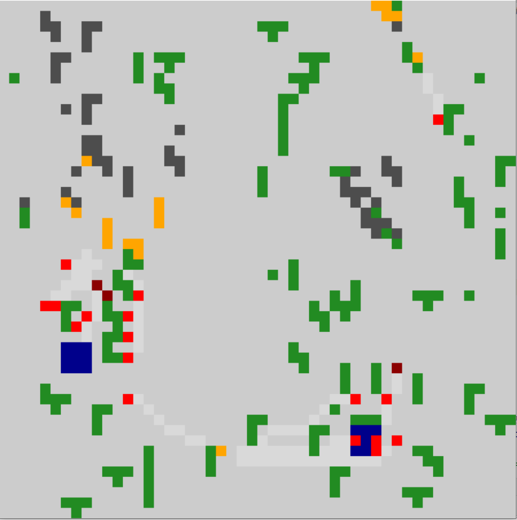
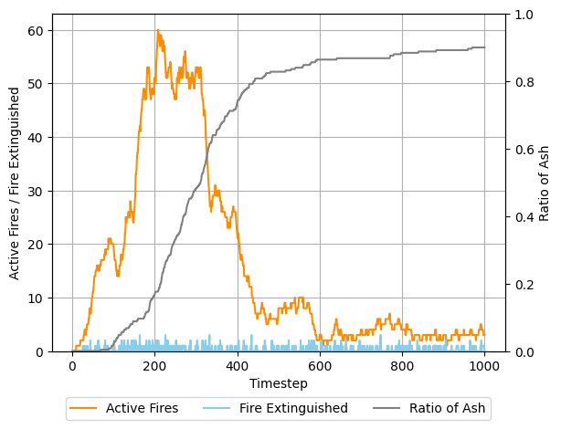
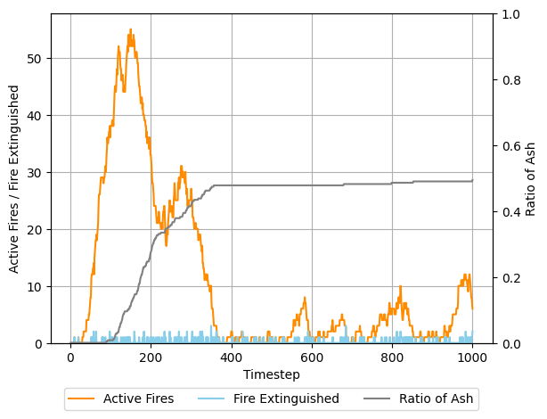
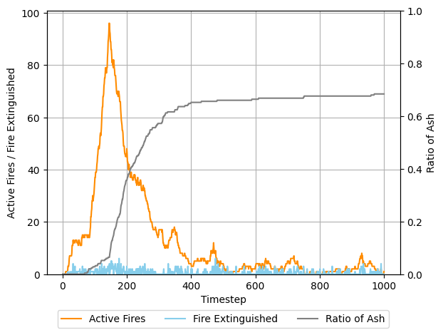
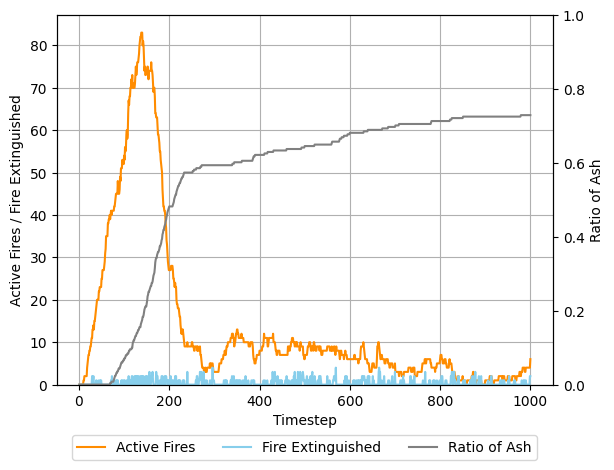
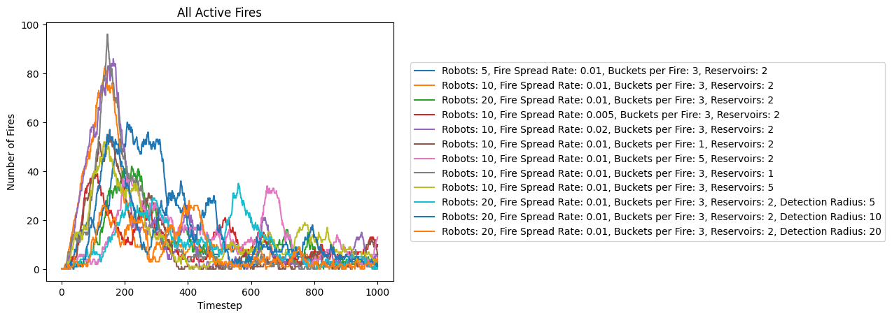
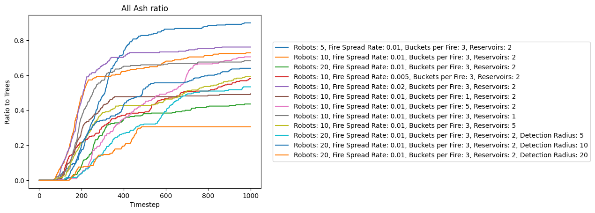
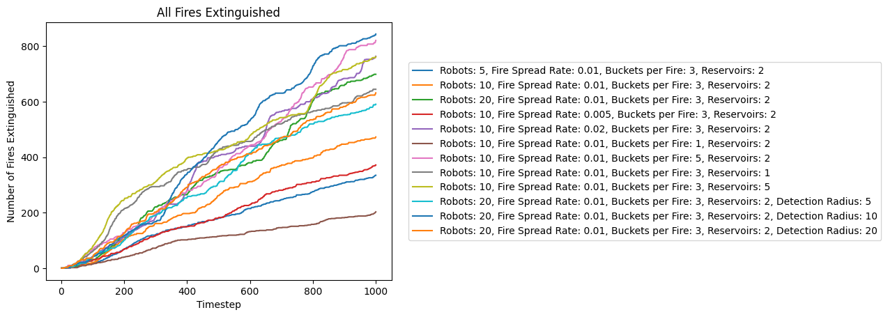
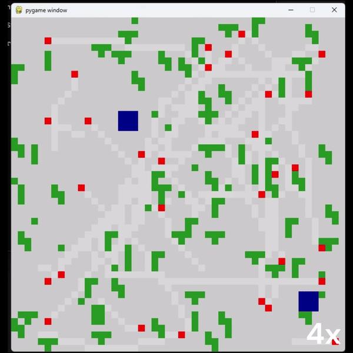

# Firefighting Using Robot Swarmss
This Project introduces an innovative swarm robotics algorithm tailored for forest fire containment. The project encapsulates a comprehensive study on optimizing swarm parameters to enhance firefighting strategies efficiently. By conducting simulations, our team has explored various configurations, focusing on robot count, forest density, and other pivotal factors. This endeavor aims to significantly improve firefighting tactics, ensuring better safety and effectiveness in combating forest fires.
## Steps to run the code
- Install Numpy, Pygame, Matplotlib, and Pandas libraries before running the code.
- Clone the repository and make it the active folder.
- To run the code simply run the `simulation.py` file in the repository.
- To plot the graphs just run the `PlotGraphs.ipynb` script after running the simulation which will generate the csv file.
- In Code folder:
  ```
  python simulation.py
  ```
## Report
For detailed description of the math see the report [here](Report.pdf).
## Plots and Animations
Environment
<p float="middle">

<!--  -->
</p>
Fire Spread Based on Number of Robots
<p float="middle">
<!--  -->




</p>
Graphs
<p float="middle">
  
  
  
</p>

Swarm of Robots Extinguishing Fires
<p float="middle">

</p>

Remaining plots and graphs are present in the report.

## References
1. Mauro S. Innocente, Paolo Grasso, Self-organising swarms of fire- fighting drones: Harnessing the power of collective intelligence in decentralised multi-robot systems, Journal of Computational Science, Volume 34, 2019, Pages 80-101, ISSN 1877-7503,
2.  Ausonio, E.; Bagnerini, P.; Ghio, M. Drone Swarms in Fire Suppression Activities: A Conceptual Framework. Drones 2021, 5, 17.
3. K. A. Ghamry, M. A. Kamel and Y. Zhang, ”Multiple UAVs in forest fire fighting mission using particle swarm optimization,” 2017 International Conference on Unmanned Aircraft Systems (ICUAS), Miami, FL, USA, 2017, pp. 1404-1409, doi: 10.1109/ICUAS.2017.7991527.
4. M. A. Luna, A. Refaat Ragab, M. S. Ale Isac, P. Flores Pena and P. C. ˜ Cervera, ”A New Algorithm Using Hybrid UAV Swarm Control System for Firefighting Dynamical Task Allocation,” 2021 IEEE International Conference on Systems, Man, and Cybernetics (SMC), Melbourne, Australia, 2021, pp. 655-660, doi: 10.1109/SMC52423.2021.9659275.

## Collaborators
Ankit Talele - amtalele@wpi.edu
Harin Vashi - hvashi@wpi.edu
Yash Patel - yppatel@wpi.edu
  
